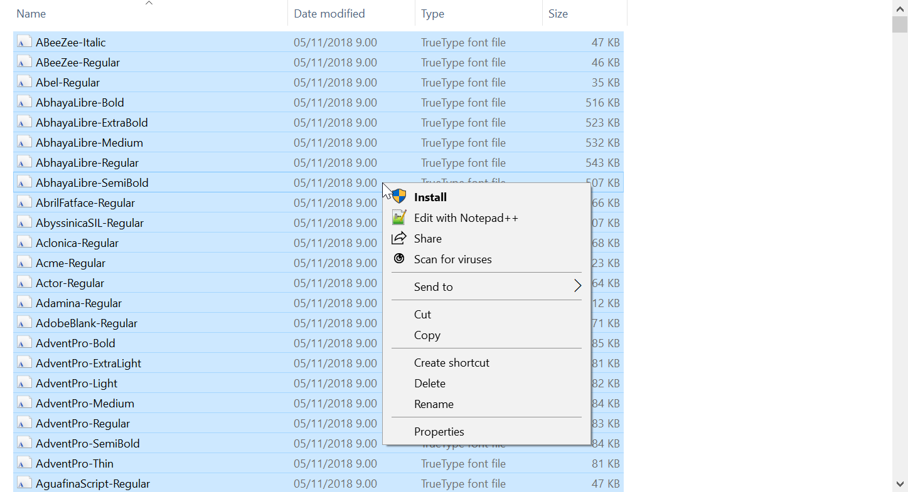

# googlefonts-loader
Copy all Google Fonts to a folder

## Usage on macOS

```bash
./script.sh
# after that has finished, run to install:
./install-osx.sh
```

## Usage on Windows

Tested with Git Bash.

1. First, run the script:
   ```bash
   ./script.sh
   ```
2. After that has finished, open `fonts/` with the File Explorer.
   1. Select all files. (ctrl+a)
   2. Right-click and click Install. 
      [](.github/screenshots/WinExplorerInstall.png)

